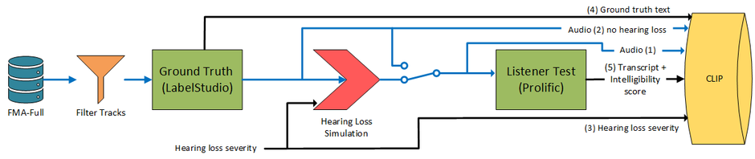

# ICASSP 2026 Lyric Intelligibility Challenge

A novel dataset for lyric intelligibility was created for the **ICASSP 2026 Lyric Intelligibility Challenge**.
This dataset consists of **11,074 music signals** of unfamous tracks sourced from the Free Music Archive (FMA) dataset.

The process of constructing the dataset involved the following steps (see diagram below):



1. **Data Source**: We started with the FMA dataset, which contains a wide variety of music tracks.
2. **Lyric Generation**: Human annotators generated ground-truth transcriptions of the lyrics.
3. **Human Annotation**: We then conducted a listening test, where participants transcribed what they heard after two reproductions. 
These transcriptions were used to assess lyric intelligibility.

For more details on the dataset construction, please refer to our paper [coming soon].

With both the ground-truth lyrics and the human transcriptions, we computed **intelligibility scores** as the ratio of matching words between the two sequences.
This was achieved using a dynamic programming algorithm that finds the alignment minimizing the Levenshtein distance between the ground truth and the listener transcription.

Before computing the scores, we applied a series of preprocessing steps to both the ground-truth and transcription sequences to ensure robustness. 
These steps included:

* Converting all numbers to words. 
* Removing punctuation.
* Correcting misspellings.
* Expanding contractions.
* Transcribing both sequences into their phonemic representations using a pronunciation dictionary.

The use of a phonemic representation helps mitigate issues arising from homophones, ensuring that words that sound the same but are spelled differently are treated equivalently in the scoring process.
The pronunciation dictionary also allowed us to identify misspellings and correct them before scoring.
However, some misspellings were not detected because the misspelled form is itself a valid word (e.g. `wont` instead of `won't`).
Phonemically, these words are similar, but only won’t is correctly expanded to `will not`, whereas `wont` is not.

For more details of how these steps were implemented:

```{tableofcontents}
```